# Project Kitty Design Document

## 1. Problem Statement

Traditional banking institutions have long been criticized for their lack of transparency, high fees, and outdated technology. Customers are often frustrated by the slow and bureaucratic processes involved in opening and managing their bank accounts, and the opaque fee structures that can make it difficult to understand the true cost of their financial transactions. Furthermore, many people are excluded from the traditional banking system altogether, either because they lack the necessary credit history or because they cannot meet the minimum balance requirements or other restrictions.

Project Kitty aims to solve these problems by providing a modern, transparent, and inclusive banking experience that is accessible to everyone. Through its innovative technology, Project Kitty will streamline account opening and management processes, making it easier for customers to understand and control their finances. In addition, Project Kitty will also offer an innovative peer-to-peer payments service. 

## 2. Top Questions to Resolve in Review

1. What parameters are sensitive and need to be sent in the request body?

2. Which java classes can be combined in DynamoDB under a common table?

3. If GET request body cannot be used for transmitting sensitive data, should we use POST/PUT requests? 

## 3. Use Cases

1. As a customer, I want to create new accounts including checking, savings, and up to one credit account with a given nickname.

2. As a customer, I want to add external accounts with given checking and routing numbers.

3. As a customer, I want to see a summary of my checking, savings and credit accounts.

4. As a customer, I want to see balances and transactions with a given accountID.

5. As a customer, I want to make and schedule payments/transfers between checking accounts, savings accounts, credit accounts, external accounts, and friends with a given source account ID, a destination account type, and a destination account ID or account holder ID.

6. As a customer, I want to deposit pending payments from my friends into my account with a given payment ID and account ID.

## 4. Project Scope

### 4.1. In Scope

* Viewing account and transaction history information
* Create internal accounts and link external accounts
* Making transfers to checking, savings, credit, external accounts, and friends
* Accepting pending transfers from friends

### 4.2. Out of Scope

* Adding new customers
* Changing customer information
* Adding/Removing friends
* Depositing funds from external accounts
* Process payments that have been scheduled for a later date

# 5. Proposed Architecture Overview

This initial iteration will provide the minimum lovable product (MLP) including  creating and retrieving Accounts, viewing their details, making payments, and accepting pending payments.

We will use API Gateway and Lambda to create seven endpoints (`Get Accounts`, `Post Accounts` `Get Transactions`, `Get Contacts`, `Get PendingPayments`, `Post Payment` and `Put PendingPayments`) that will handle the creation, update and retrieval of accounts and payments to satisfy our requirements.

We will store customers, accounts, transactions, and pending payments in a tables in DynamoDB. 

Project Kitty will also provide a web interface for users to manage their accounts. A main page will provide a summary view of their accounts, with links to get more details let them create new accounts, submit payments, and accept pending payments.

# 6. API

## 6.1. Public Models

```
// Customer

String name;
List<InternalAccount> internalAccounts;
InternalAccount creditAcount;
List<ExternalAccount> externalAccounts;
List<Customer> friends;
```

```
// InternalAccount

Customer customer;
Integer accountNumber;
String type;
String nickName;
List<Transaction> transactions;
```

```
// CreditAccount

Customer customer;
Integer accountNumber;
Integer creditLimit;
String nickName;
List<Transaction> transactions;
```

```
// ExternalAccount

Customer customer;
Integer accountNumber;
Integer routingNumber;
String nickName;
```

```
// Transaction

Account account;
Integer submittedDateTime;
Integer completedDateTime;
Double amount;
String memo;
```

```
// Transfer

Customer customer;
Account sourceAccount;
Account destinationAccount;
Integer submittedDateTime;
Integer completedDateTime;
Double amount;
String memo;
```

```
// PendingPayment

Customer fromCustomer;
Customer toCustomer;
Account fromAccount;
Account toAccount;
Integer submittedDateTime;
Integer completedDateTime;
Double amount;
String memo;
```

## 6.1 *Get Accounts Endpoint*

* Accepts `GET` requests to `/customers/accounts`
* Accepts a request body customer ID and returns the related accounts.
    * If the given customer ID is not found, will throw a
      `CustomerNotFoundException`

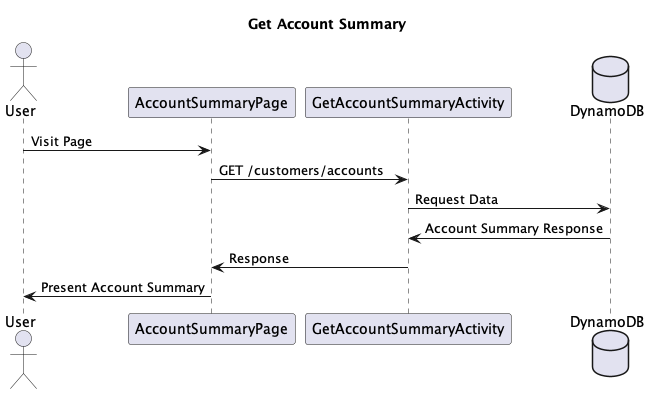

## 6.2 *Post Accounts Endpoint*

* Accepts `POST` requests to `/customers/accounts`
* Accepts a request body customer ID, nickname, type, and routing/account number if type == 'external' and creates a related account.
    * If the given customer ID is not found, will throw a
      `CustomerNotFoundException`
    * If the given account nickname already exists, will throw a
      `AccountNameAlreadyExistsException`
    * If the given type is not valid, will throw a
      `InvalidTypeException`
    * If type == 'external' and missing routing/account number, will throw a
      `MissingRoutingOrAccountNumberException`
    * If type == 'credit' and a credit account already exists, will throw a
      `CreditAccountAlreadyExistsException`

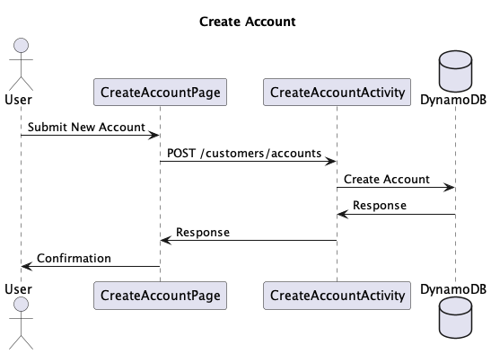

## 6.3 *Get Transactions Endpoint*

* Accepts `GET` requests to `/customers/accounts/transactions`
* Accepts a request body customer ID and account ID and returns the related transactions.
    * If the given customer ID is not found, will throw a
      `CustomerNotFoundException`
    * If the given account ID is not found, will throw a
      `AccountNotFoundException`

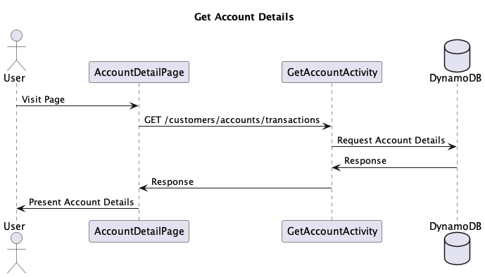

## 6.4 *Get Contacts Endpoint*

* Accepts `GET` requests to `/customers/contacts`
* Accepts a request body customer ID and returns the related contacts.
    * If the given customer ID is not found, will throw a
      `CustomerNotFoundException`

## 6.5 *Get PendingPayments Endpoint*

* Accepts `GET` requests to `/customers/pendingpayments`
* Accepts a request body customer ID and returns the pending peer to peer payments.
    * If the given customer ID is not found, will throw a
      `CustomerNotFoundException`

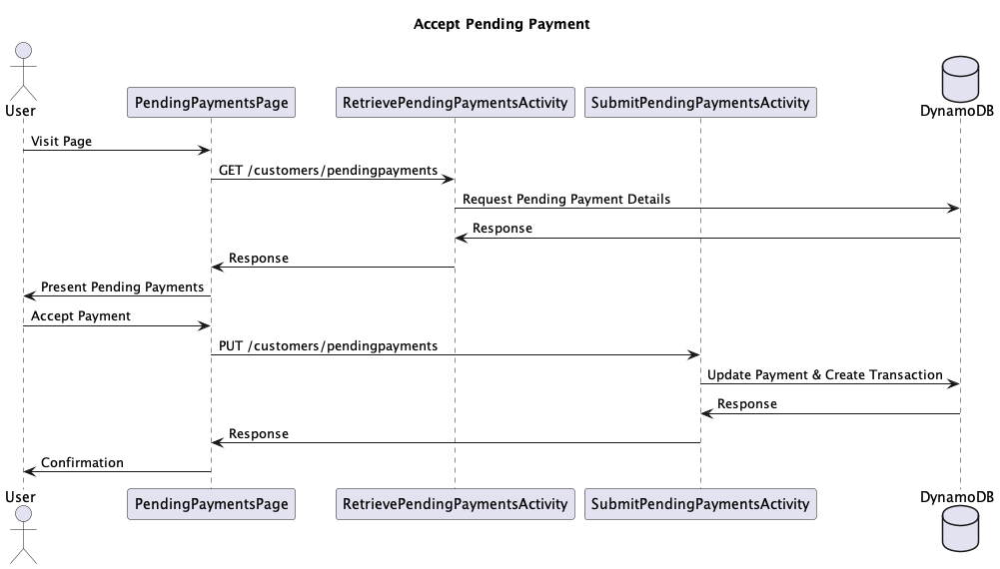

## 6.6 *Post Payment Endpoint*

* Accepts `POST` requests to `/customers/payments`
* Accepts a request body sender customer ID, source account ID, amount, type, memo, and recipient customer ID if type == 'peertopeer' to submit a payment.
    * If the given sender customer ID is not found, will throw a
      `SenderNotFoundException`
    * If the given account ID is not found, will throw a
      `AccountNotFoundException`
    * If the given recipient customer ID is not found, will throw a
      `RecipientNotFoundException`
    * If the given type is not valid, will throw a
      `InvalidTypeException`
    * If the given recipient is not a contact of the sender, will throw a
      `RecipientNotAContactException`

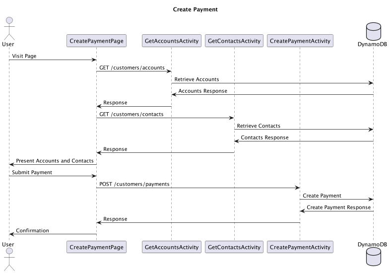

## 6.7 *Put PendingPayments Endpoint*

* Accepts `PUT` requests to `/customers/pendingpayments`
* Accepts a request body payment ID and account ID to accept a peer to peer transfer.
    * If the given customer ID is not found, will throw a
      `CustomerNotFoundException` 
    * If the given payment ID is not found, will throw a
      `PaymentNotFoundException`
    * If the given payment has already been accepted, will throw a
      `PaymentAlreadyAcceptedException`


# 7. Tables

### 7.1 `Customers`

```
customerId // partition key, string
internalAccounts // list
creditAcount // list
externalAccounts // list
friends // list
```

### 7.2 `Account`

```
customer // partition key, string
accountNumber // sort key, string
type // string
nickName // string
creditLimit // number
```

### 7.3 `Transaction`

```
account // partition key, string 
submittedDateTime // sort key, number
completedDateTime // number
amount // number
memo // string
```

### 7.4 `Transfer`

```
destinationCustomerID // partition key, string
sourceCustomerID // sort key, string
destinationAccount // string
sourceAccount // string
submittedDateTime // number
completedDateTime // number
amount // number
memo // string
```

# 8. Pages

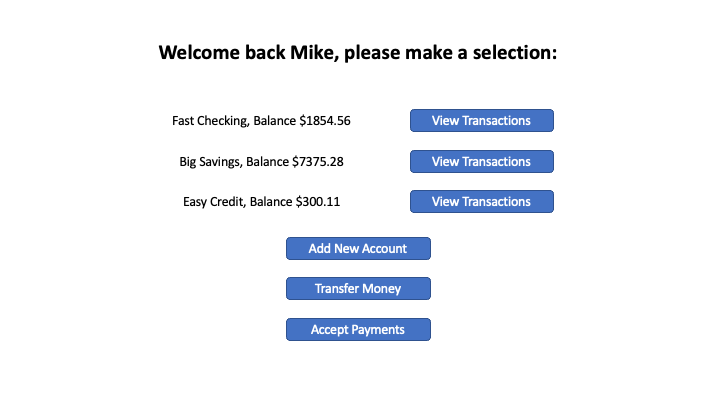

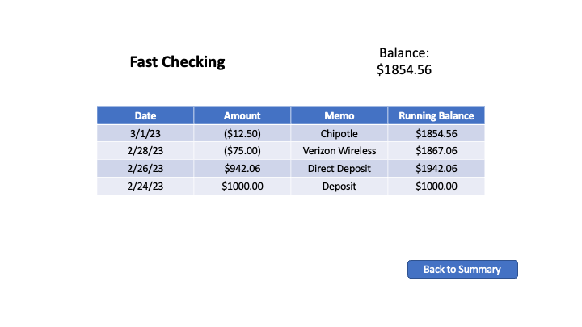

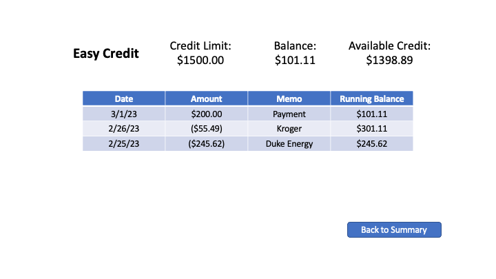

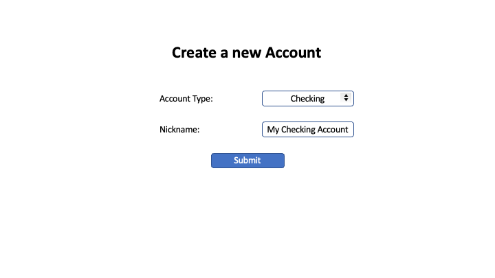

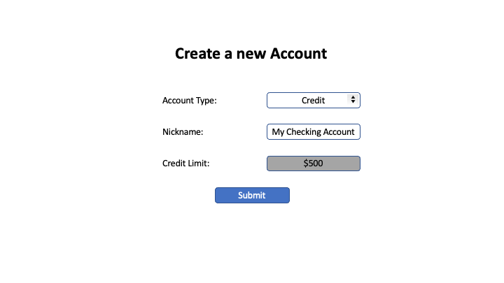

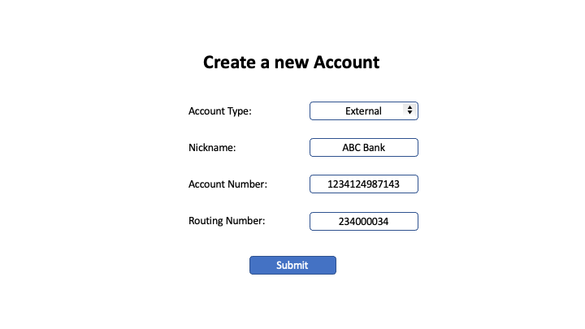

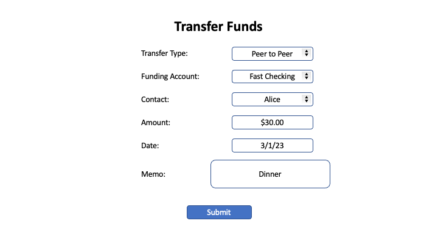

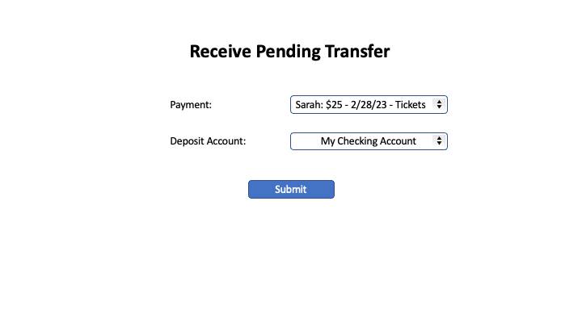